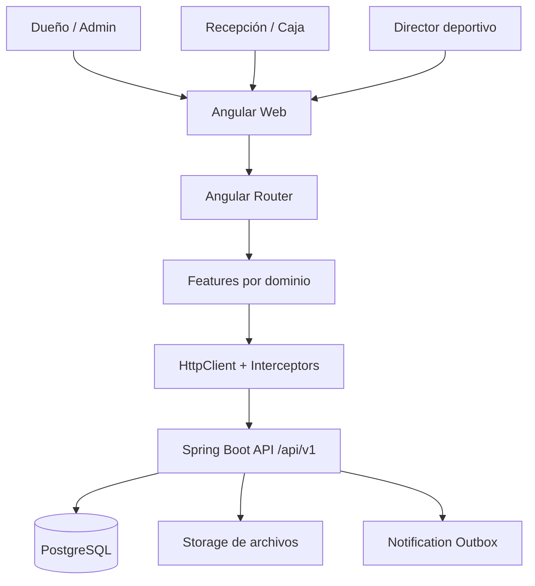
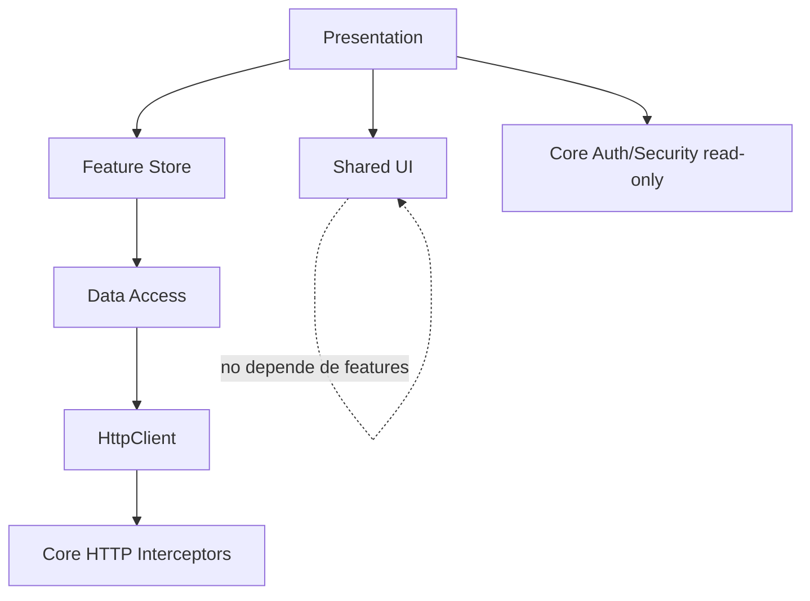

# Arquitectura Web Angular - GymBox

## 0. Propósito del documento

Este documento define la arquitectura de la aplicación web de GymBox construida con Angular.

La web será el canal principal para:

- Dueño / administración.
- Recepción / caja.
- Dirección deportiva.
- Gestión de usuarios, permisos y reportes.
- Módulos deportivos avanzados en fases posteriores.

La arquitectura está alineada con los documentos internos del proyecto:

- `arquitectura_aplicacion_gimnasio_box.pdf / .md`
- `roadmap_aplicacion_gimnasio_box.pdf / .md`
- `GymBox_Backend_Fase1_Blueprint_IA.pdf / .md`
- Documentación de procesos administrativos y deportivos del gimnasio.
- Programa de entrenamiento de boxeo de 12 semanas.

La decisión principal es mantener una web simple, modular, auditable y preparada para crecer, sin sobrediseñar el MVP.

---

# 1. Decisiones base

## 1.1 Decisiones no negociables

| Decisión | Aplicación en Angular |
| --- | --- |
| Backend como fuente de verdad | Angular nunca decide reglas críticas; solo consume resultados del API. |
| Seguridad real en backend | Guards y botones ocultos son UX, no seguridad definitiva. |
| REST versionado bajo `/api/v1` | Todos los clientes HTTP apuntan al contrato del backend. |
| Organización por dominio | La web se divide por features: students, memberships, payments, cash, attendance, reports, sports, security. |
| MVP simple | Signals/RxJS por feature; no NgRx al inicio salvo necesidad real. |
| Formularios fuertes | Reactive Forms tipados para altas, pagos, membresías y filtros complejos. |
| Auditoría visible | Acciones sensibles deben mostrar actor, fecha, motivo y trazabilidad cuando el backend lo exponga. |
| Pagos y caja con cuidado | No simular reglas financieras en Angular; el backend valida caja abierta, folios, permisos e idempotencia. |

## 1.2 Stack recomendado

| Capa | Recomendación |
| --- | --- |
| Framework | Angular actual con standalone components. |
| Lenguaje | TypeScript strict. |
| UI Kit | Angular Material/CDK para MVP. Alternativa aceptable: PrimeNG, pero no mezclar ambas librerías. |
| Estado local | Signals para estado de pantalla y stores por feature. |
| Datos asíncronos | HttpClient + RxJS. |
| Formularios | Reactive Forms tipados. |
| Rutas | Standalone routing con lazy loading por feature. |
| Testing unitario | Vitest mediante Angular CLI actual. |
| E2E | Playwright. |
| Build | Angular CLI. |
| Deploy | Contenedor Nginx sirviendo archivos estáticos. |
| API | Spring Boot monolito modular, `/api/v1`. |

## 1.3 Principio rector

> La web Angular debe ser una capa de presentación y operación.  
> Las decisiones de negocio viven en el backend.  
> Angular organiza flujos, formularios, permisos visuales, navegación y experiencia de usuario.

---

# 2. Alcance funcional de la web

## 2.1 Fase 0 - Preparación

La Fase 0 debe dejar la base técnica lista:

| Entregable | Resultado esperado |
| --- | --- |
| Repositorio web | Proyecto Angular inicial con estructura definida. |
| Shell | Layout principal con menú, topbar y rutas placeholder. |
| Auth placeholder | Pantalla de login conectable al backend. |
| Guards base | Protección por sesión y permisos. |
| HTTP base | Interceptores de auth, errores, traceId y loading. |
| UI base | Tema, componentes compartidos, tabla base, empty states. |
| CI base | `npm ci`, lint, test y build. |

## 2.2 Fase 1 - MVP operativo administrativo

La web debe cubrir:

| Módulo | Alcance web |
| --- | --- |
| Auth | Login, refresh, logout, usuario actual. |
| Dashboard | Alumnos activos, vencidos, pagos del día, ingresos y asistencias. |
| Students | Alta, edición, búsqueda, foto, fecha de nacimiento, tutor, contacto de emergencia, estado. |
| Memberships | Planes, membresías, vigencias, renovación. |
| Payments | Registro de pago, búsqueda, folio, recibo básico. |
| Cash | Apertura, caja actual, cierre básico. |
| Attendance | Consulta y registro administrativo de check-in cuando aplique. |
| Security | Usuarios, roles y permisos básicos. |
| Reports | Reportes administrativos mínimos. |

## 2.3 Preparación para Fase 2

La estructura ya debe dejar espacios para:

- Caja robusta.
- Evidencia fotográfica.
- Entrega de efectivo al dueño.
- Auditoría consultable.
- Cancelaciones controladas.
- Descuentos autorizados.
- Reporte diario antifraude.

## 2.4 Preparación para Fase 3

La estructura ya debe dejar espacios para:

- Programas deportivos.
- Ciclos de 12 semanas.
- Sesiones.
- Grupos.
- Evaluaciones.
- RPE.
- Bienestar.
- Observaciones técnicas.
- Dashboard deportivo.

---

# 3. Vista general de arquitectura



## 3.1 Responsabilidades de Angular

Angular sí debe encargarse de:

- Renderizar pantallas.
- Gestionar formularios.
- Navegar por rutas.
- Mostrar permisos visuales.
- Proteger rutas para UX.
- Mostrar errores claros.
- Manejar loading, empty states y filtros.
- Enviar comandos al backend.
- Mostrar resultados auditables.
- Mantener estado temporal de pantalla.

Angular no debe encargarse de:

- Calcular autorización final.
- Decidir si un pago es válido.
- Modificar vencimientos por su cuenta.
- Calcular folios.
- Validar caja abierta como única fuente.
- Guardar reglas críticas de membresía.
- Decidir si un menor puede quedar sin tutor.
- Persistir datos fuera del API.

---

# 4. Estructura del repositorio Angular

## 4.1 Nombre sugerido

```text
gymbox-web
```

## 4.2 Estructura raíz

```text
gymbox-web/
|-- src/
|   |-- app/
|   |-- assets/
|   |-- environments/
|   |-- styles/
|   |-- main.ts
|   `-- index.html
|
|-- public/
|-- angular.json
|-- package.json
|-- package-lock.json
|-- tsconfig.json
|-- tsconfig.app.json
|-- tsconfig.spec.json
|-- eslint.config.js
|-- Dockerfile
|-- nginx.conf
|-- README.md
`-- docs/
    `-- architecture/
        `-- gymbox_web_angular_architecture.md
```

## 4.3 Estructura dentro de `src/app`

```text
src/app/
|-- app.config.ts
|-- app.routes.ts
|-- app.component.ts
|
|-- core/
|   |-- auth/
|   |-- config/
|   |-- http/
|   |-- security/
|   |-- errors/
|   |-- logging/
|   `-- storage/
|
|-- shell/
|   |-- app-shell/
|   |-- sidebar/
|   |-- topbar/
|   |-- breadcrumb/
|   `-- shell.routes.ts
|
|-- shared/
|   |-- ui/
|   |-- forms/
|   |-- validators/
|   |-- pipes/
|   |-- directives/
|   |-- table/
|   |-- dialogs/
|   `-- utils/
|
`-- features/
    |-- auth/
    |-- dashboard/
    |-- students/
    |-- memberships/
    |-- payments/
    |-- cash/
    |-- attendance/
    |-- reports/
    |-- security/
    |-- audit/
    |-- sports/
    `-- settings/
```

## 4.4 Regla de organización

La organización principal debe ser por feature, no por tipo técnico global.

Correcto:

```text
features/students/student-list/
features/students/student-form/
features/students/student-detail/
features/students/api/
features/students/model/
```

Evitar:

```text
components/
services/
models/
pages/
```

como carpetas globales con todo mezclado.

Sí se permiten `core` y `shared` porque representan infraestructura transversal y UI reutilizable.

---

# 5. Convenciones de nombres

## 5.1 Idioma

| Elemento | Idioma |
| --- | --- |
| Código, clases, interfaces, archivos | Inglés |
| Textos visibles para usuario | Español |
| Mensajes de error de negocio | Español |
| Rutas web | Inglés recomendado para alinearse con API |
| Permisos | Códigos técnicos en inglés o snake/kebab estable |

Ejemplos:

```text
student-form.component.ts
membership-renewal-dialog.component.ts
payment-register.page.ts
cash-register-current.store.ts
```

UI:

```text
"Registrar pago"
"Alumno vencido"
"Fecha de nacimiento"
"Contacto de emergencia"
```

## 5.2 Archivos

- Usar kebab-case.
- Un concepto principal por archivo.
- Tests junto al archivo probado.
- Sufijo `.spec.ts` para unit tests.
- Evitar `utils.ts` genéricos cuando la lógica pertenezca a un dominio.

Ejemplo:

```text
student-age.pipe.ts
student-age.pipe.spec.ts
minor-guardian.validator.ts
minor-guardian.validator.spec.ts
```

---

# 6. Capas lógicas de la web

## 6.1 Capas

```text
Presentation
  Componentes, templates, estilos, dialogs, páginas.

Feature State
  Stores con signals, filtros, selección, loading y error.

Data Access
  Servicios HTTP, DTOs, mappers y API clients.

Core
  Auth, sesión, interceptores, guards, configuración, errores.

Shared
  UI genérica, pipes, validators y directivas reutilizables.
```

## 6.2 Flujo de dependencias permitido



## 6.3 Reglas de dependencia

| Regla | Descripción |
| --- | --- |
| `shared` no importa `features` | Shared debe ser reutilizable y no saber de alumnos, pagos o caja. |
| `core` no depende de features | Core administra infraestructura global. |
| Una feature no importa internals de otra feature | Si requiere datos, usar servicios públicos o endpoints del backend. |
| DTOs no deben contaminar toda la UI | Mapear a modelos de vista cuando sea útil. |
| Stores no deben hacer reglas críticas | Solo orquestan UI y llamadas al API. |

---

# 7. Core

## 7.1 Estructura de `core`

```text
core/
|-- auth/
|   |-- auth.service.ts
|   |-- auth-session.store.ts
|   |-- auth.models.ts
|   `-- token-storage.service.ts
|
|-- config/
|   |-- app-config.ts
|   |-- environment.provider.ts
|   `-- api-url.token.ts
|
|-- http/
|   |-- auth.interceptor.ts
|   |-- refresh-token.interceptor.ts
|   |-- api-error.interceptor.ts
|   |-- loading.interceptor.ts
|   |-- trace-id.interceptor.ts
|   |-- idempotency-key.ts
|   `-- http-context.tokens.ts
|
|-- security/
|   |-- auth.guard.ts
|   |-- permission.guard.ts
|   |-- permission.directive.ts
|   |-- permission.service.ts
|   `-- permission-codes.ts
|
|-- errors/
|   |-- api-error.model.ts
|   |-- error-message.service.ts
|   `-- global-error-handler.ts
|
|-- logging/
|   |-- logger.service.ts
|   `-- trace.service.ts
|
`-- storage/
    |-- browser-storage.service.ts
    `-- secure-session-storage.service.ts
```

## 7.2 Auth

### Responsabilidades

- Login.
- Refresh token.
- Logout.
- Cargar usuario actual.
- Exponer sesión como signal readonly.
- Exponer permisos actuales.
- Detectar expiración.
- Limpiar sesión cuando refresh falle.

### Modelo de sesión

```ts
export interface AuthUser {
  id: string;
  username: string;
  fullName: string;
  branchId: string;
  roles: string[];
  permissions: string[];
}

export interface AuthSession {
  authenticated: boolean;
  accessToken: string | null;
  user: AuthUser | null;
}
```

### Recomendación de almacenamiento

Opción recomendada para producción:

```text
Access token: memoria del navegador.
Refresh token: cookie HttpOnly, Secure, SameSite.
```

Opción temporal para MVP si el backend todavía devuelve tokens en JSON:

```text
Access token: sessionStorage.
Refresh token: sessionStorage con expiración corta.
```

No se recomienda guardar refresh token en `localStorage` como decisión permanente.

## 7.3 Interceptores

| Interceptor | Responsabilidad |
| --- | --- |
| `authInterceptor` | Agrega `Authorization: Bearer <token>` cuando aplique. |
| `refreshTokenInterceptor` | Intenta renovar sesión ante 401 recuperable. |
| `apiErrorInterceptor` | Normaliza errores del backend. |
| `loadingInterceptor` | Alimenta indicador global o por contexto. |
| `traceIdInterceptor` | Adjunta/lee `X-Trace-Id` para soporte. |
| `timeoutInterceptor` | Opcional para cortar llamadas colgadas. |
| `idempotencyInterceptor` | Adjunta `Idempotency-Key` en pagos y comandos críticos cuando se indique. |

## 7.4 ApiError estándar esperado

El backend debe responder errores de forma estable:

```ts
export interface ApiError {
  code: string;
  message: string;
  details?: FieldViolation[];
  timestamp: string;
  traceId: string;
}

export interface FieldViolation {
  field: string;
  message: string;
}
```

Angular debe mapear:

- `details[].field` a errores de formulario.
- `message` a alerta visible.
- `traceId` a soporte técnico.
- `code` a mensajes específicos cuando aplique.

---

# 8. Shared

## 8.1 Propósito

`shared` contiene piezas reutilizables que no pertenecen a un dominio específico.

## 8.2 Estructura

```text
shared/
|-- ui/
|   |-- page-header/
|   |-- status-chip/
|   |-- money-label/
|   |-- empty-state/
|   |-- loading-state/
|   |-- confirm-dialog/
|   `-- form-section/
|
|-- table/
|   |-- data-table/
|   |-- table-column.model.ts
|   `-- table-query.model.ts
|
|-- forms/
|   |-- control-error/
|   |-- date-field/
|   |-- money-field/
|   `-- image-upload/
|
|-- validators/
|   |-- phone.validator.ts
|   |-- birth-date.validator.ts
|   |-- money.validator.ts
|   `-- required-if.validator.ts
|
|-- pipes/
|   |-- age.pipe.ts
|   |-- money.pipe.ts
|   |-- membership-status.pipe.ts
|   `-- date-time.pipe.ts
|
|-- directives/
|   |-- autofocus.directive.ts
|   |-- has-permission.directive.ts
|   `-- prevent-double-click.directive.ts
|
`-- utils/
    |-- date-utils.ts
    `-- file-size-utils.ts
```

## 8.3 Reglas

- No colocar reglas de negocio específicas en `shared`.
- No colocar servicios HTTP de features en `shared`.
- No crear componentes compartidos prematuramente.
- Un componente se promueve a `shared` cuando al menos dos features lo usan.

---

# 9. Shell y layout

## 9.1 Shell principal

El shell representa la aplicación autenticada.

```text
shell/
|-- app-shell/
|   |-- app-shell.component.ts
|   |-- app-shell.component.html
|   `-- app-shell.component.scss
|-- sidebar/
|-- topbar/
|-- breadcrumb/
`-- shell.routes.ts
```

## 9.2 Layout

Debe incluir:

- Sidebar por permisos.
- Topbar con usuario, sucursal y logout.
- Breadcrumb basado en rutas.
- Área principal.
- Notificaciones/alerts.
- Estado de carga global.
- Indicador de sesión expirada.

## 9.3 Menú inicial

```text
Dashboard
Alumnos
Membresías
Pagos
Caja
Asistencia
Reportes
Usuarios y permisos
Configuración
```

Fase 2:

```text
Auditoría
Control antifraude
Entregas de efectivo
Cancelaciones
```

Fase 3:

```text
Deportivo
Programas
Ciclos
Grupos
Evaluaciones
Seguimiento
Dashboard deportivo
```

---

# 10. Rutas

## 10.1 Principios

- Lazy loading por feature.
- Guards por sesión y permisos.
- Títulos de página configurados en rutas.
- Metadata de permisos en `data`.
- Wildcard final para 404.
- Rutas de detalle con ID.
- Filtros de búsqueda reflejados en query params cuando sea útil.

## 10.2 Estructura de rutas

```text
/auth/login
/dashboard

/students
/students/new
/students/:studentId
/students/:studentId/edit

/memberships/plans
/memberships
/memberships/:membershipId
/memberships/student/:studentId

/payments
/payments/new
/payments/:paymentId
/payments/:paymentId/receipt

/cash/current
/cash/open
/cash/close
/cash/sessions

/attendance/today
/attendance/student/:studentId

/reports/admin
/reports/cash

/security/users
/security/roles
/security/permissions

/settings/branch
/settings/catalogs

/audit
/sports
```

## 10.3 `app.routes.ts` sugerido

```ts
import { Routes } from '@angular/router';
import { authGuard } from './core/security/auth.guard';
import { permissionGuard } from './core/security/permission.guard';
import { AppShellComponent } from './shell/app-shell/app-shell.component';

export const routes: Routes = [
  {
    path: 'auth',
    loadChildren: () =>
      import('./features/auth/auth.routes').then(m => m.AUTH_ROUTES),
  },
  {
    path: '',
    component: AppShellComponent,
    canActivate: [authGuard],
    canActivateChild: [permissionGuard],
    children: [
      {
        path: '',
        pathMatch: 'full',
        redirectTo: 'dashboard',
      },
      {
        path: 'dashboard',
        title: 'Dashboard',
        data: { permissionsAny: ['dashboard.read'] },
        loadChildren: () =>
          import('./features/dashboard/dashboard.routes').then(m => m.DASHBOARD_ROUTES),
      },
      {
        path: 'students',
        title: 'Alumnos',
        data: { permissionsAny: ['students.read'] },
        loadChildren: () =>
          import('./features/students/students.routes').then(m => m.STUDENTS_ROUTES),
      },
      {
        path: 'payments',
        title: 'Pagos',
        data: { permissionsAny: ['payments.read'] },
        loadChildren: () =>
          import('./features/payments/payments.routes').then(m => m.PAYMENTS_ROUTES),
      },
    ],
  },
  {
    path: '**',
    loadComponent: () =>
      import('./features/not-found/not-found.component').then(c => c.NotFoundComponent),
  },
];
```

## 10.4 Guards

### `authGuard`

- Si no hay sesión: redirige a `/auth/login`.
- Conserva `redirectUrl`.
- Si la sesión existe: permite pasar.

### `permissionGuard`

- Lee `route.data.permissionsAny`.
- Si el usuario tiene al menos un permiso: permite pasar.
- Si no tiene permisos: redirige a `/forbidden`.
- Nunca se considera seguridad definitiva.

### Regla crítica

Aunque la ruta o botón se oculte, el backend debe volver a validar permiso.

---

# 11. Permisos web

## 11.1 Roles conceptuales

| Rol | Uso |
| --- | --- |
| Owner | Acceso total y reportes sensibles. |
| Admin | Operación administrativa. |
| Cashier / Recepción | Alumnos, pagos, caja básica y asistencia. |
| Instructor | Vista operativa, asistencia y seguimiento básico. |
| Sports Manager | Gestión deportiva y evaluaciones. |
| Student | Reservado para app alumno. |

## 11.2 Permisos iniciales

```text
dashboard.read

students.read
students.create
students.update
students.change-status
students.upload-photo

memberships.read
memberships.create
memberships.renew
plans.read
plans.create
plans.update

payments.read
payments.create
payments.receipt.read

cash.open
cash.read-current
cash.close

attendance.read
attendance.check-in
attendance.override

users.read
users.create
users.update
roles.read
roles.assign

reports.admin.read
reports.cash.read

audit.read

sports.programs.read
sports.programs.write
sports.evaluations.read
sports.evaluations.write
sports.dashboard.read
```

## 11.3 Directiva de permiso

Uso sugerido:

```html
<button
  type="button"
  *hasPermission="'payments.create'"
  (click)="openRegisterPayment()">
  Registrar pago
</button>
```

Regla:

```text
La directiva solo oculta o muestra UI.
El backend siempre decide si la acción procede.
```

---

# 12. Data Access

## 12.1 Regla general

Cada feature tiene su propio `api` o `data-access`.

Ejemplo:

```text
features/students/
|-- api/
|   |-- students-api.service.ts
|   |-- students.dto.ts
|   `-- students.mapper.ts
|-- model/
|   |-- student.model.ts
|   `-- student-status.model.ts
|-- student-list/
|-- student-form/
`-- students.routes.ts
```

## 12.2 DTO vs ViewModel

DTO del backend:

```ts
export interface StudentResponseDto {
  id: string;
  fullName: string;
  birthDate: string;
  currentAge: number;
  ageCategory: string;
  status: string;
  membershipStatus: string;
  photoUrl?: string;
}
```

Modelo para UI:

```ts
export interface StudentListItem {
  id: string;
  name: string;
  ageLabel: string;
  statusLabel: string;
  membershipStatusLabel: string;
  photoUrl?: string;
  blockedForCheckIn: boolean;
}
```

## 12.3 Servicios HTTP

```ts
@Injectable({ providedIn: 'root' })
export class StudentsApi {
  private readonly http = inject(HttpClient);
  private readonly apiUrl = inject(API_URL);

  search(query: StudentSearchQuery): Observable<PageResponse<StudentResponseDto>> {
    return this.http.get<PageResponse<StudentResponseDto>>(
      `${this.apiUrl}/students`,
      { params: buildHttpParams(query) }
    );
  }

  create(request: CreateStudentRequestDto): Observable<StudentResponseDto> {
    return this.http.post<StudentResponseDto>(
      `${this.apiUrl}/students`,
      request
    );
  }
}
```

## 12.4 Paginación estándar

Angular debe esperar:

```ts
export interface PageResponse<T> {
  content: T[];
  page: number;
  size: number;
  totalElements: number;
  totalPages: number;
}
```

Query estándar:

```ts
export interface PageQuery {
  page: number;
  size: number;
  sort?: string;
}
```

---

# 13. Estado de aplicación

## 13.1 Estrategia

Para el MVP:

- Stores por feature con signals.
- RxJS para llamadas HTTP y streams de formularios.
- Servicios simples para orquestar.
- No usar NgRx al inicio.

NgRx solo se justifica si aparecen:

- Múltiples features compartiendo estado complejo.
- Cache global con invalidación difícil.
- Flujos offline amplios.
- Reglas de actualización optimista.
- Equipo grande que necesita disciplina Redux.

## 13.2 Store base por feature

```ts
export interface QueryState<T> {
  loading: boolean;
  data: T | null;
  error: ApiError | null;
}

@Injectable()
export class StudentsListStore {
  private readonly api = inject(StudentsApi);

  private readonly _loading = signal(false);
  private readonly _items = signal<StudentListItem[]>([]);
  private readonly _error = signal<ApiError | null>(null);
  private readonly _query = signal<StudentSearchQuery>({
    page: 0,
    size: 20,
  });

  readonly loading = this._loading.asReadonly();
  readonly items = this._items.asReadonly();
  readonly error = this._error.asReadonly();
  readonly query = this._query.asReadonly();

  load(): void {
    this._loading.set(true);

    this.api.search(this._query()).pipe(
      finalize(() => this._loading.set(false))
    ).subscribe({
      next: page => this._items.set(page.content.map(mapStudentListItem)),
      error: error => this._error.set(error),
    });
  }

  updateQuery(query: Partial<StudentSearchQuery>): void {
    this._query.update(current => ({ ...current, ...query }));
    this.load();
  }
}
```

## 13.3 Estado que sí puede vivir en Angular

- Filtros.
- Página actual.
- Ordenamiento.
- Tab activo.
- Datos cargados para mostrar.
- Form dirty/touched.
- Loading/error.
- Selecciones temporales.

## 13.4 Estado que no debe vivir solo en Angular

- Vencimiento de membresía definitivo.
- Folio de pago.
- Monto esperado de caja.
- Estado real de pago.
- Permisos definitivos.
- Auditoría.
- Cierre de caja.
- Cancelación de pago.

---

# 14. Formularios

## 14.1 Estrategia

Usar Reactive Forms tipados para:

- Alta de alumno.
- Edición de alumno.
- Tutor y contacto de emergencia.
- Planes.
- Membresías.
- Registro de pago.
- Apertura/cierre de caja.
- Filtros complejos.
- Evaluaciones deportivas.

## 14.2 Formulario de alumno

Campos mínimos:

```text
name
lastName
phone
email
birthDate
guardian
emergencyContact
initialLevel
goal
restrictions
photo
```

Validaciones UI:

| Campo | Validación |
| --- | --- |
| Nombre | Requerido, longitud máxima. |
| Teléfono | Formato local aceptado. |
| Email | Formato email, opcional según regla. |
| Fecha nacimiento | Requerida, no futura. |
| Tutor | Requerido si es menor de edad. |
| Foto | MIME permitido, tamaño máximo. |

Regla importante:

```text
La UI puede advertir que un menor requiere tutor.
El backend debe rechazar definitivamente si la regla está activa y falta tutor.
```

## 14.3 Formulario de pago

Campos:

```text
studentId
concept
planId
amount
paymentMethod
reference
notes
idempotencyKey
```

Reglas UI:

- Botón deshabilitado mientras se envía.
- Confirmación antes de registrar.
- Enviar `Idempotency-Key`.
- Mostrar folio devuelto por backend.
- Mostrar error si no hay caja abierta.

## 14.4 Manejo de errores de formulario

Cuando backend responda:

```json
{
  "code": "VALIDATION_ERROR",
  "message": "Hay campos inválidos",
  "details": [
    { "field": "birthDate", "message": "La fecha de nacimiento es obligatoria" }
  ],
  "traceId": "abc-123"
}
```

Angular debe:

- Asignar error al control `birthDate`.
- Mostrar alerta general.
- Mostrar `traceId` en sección de soporte si aplica.

---

# 15. Diseño por features

## 15.1 Auth

```text
features/auth/
|-- login/
|-- forgot-password/
|-- auth.routes.ts
`-- auth.models.ts
```

Pantallas:

- Login.
- Recuperar contraseña futura.
- Sesión expirada.

Endpoints:

```text
POST /api/v1/auth/login
POST /api/v1/auth/refresh
POST /api/v1/auth/logout
GET  /api/v1/auth/me
```

## 15.2 Dashboard

```text
features/dashboard/
|-- admin-dashboard/
|-- dashboard-card/
|-- dashboard.routes.ts
|-- api/
`-- model/
```

Widgets Fase 1:

- Alumnos activos.
- Alumnos vencidos.
- Pagos del día.
- Ingresos del día.
- Asistencias del día.
- Alertas: caja no abierta, caja pendiente, vencidos.

Endpoint:

```text
GET /api/v1/reports/admin/dashboard
```

## 15.3 Students

```text
features/students/
|-- student-list/
|-- student-detail/
|-- student-form/
|-- student-photo/
|-- student-status-chip/
|-- student-guardian-section/
|-- students.routes.ts
|-- api/
`-- model/
```

Pantallas:

- Listado con filtros.
- Alta.
- Edición.
- Detalle.
- Foto.
- Estado y membresía actual.
- Historial básico de asistencia/pagos si API lo expone.

Endpoints:

```text
GET  /api/v1/students
POST /api/v1/students
GET  /api/v1/students/{id}
PUT  /api/v1/students/{id}
PATCH /api/v1/students/{id}/status
POST /api/v1/students/{id}/photo
```

## 15.4 Memberships

```text
features/memberships/
|-- plan-list/
|-- plan-form/
|-- membership-list/
|-- membership-detail/
|-- renew-membership-dialog/
|-- memberships.routes.ts
|-- api/
`-- model/
```

Pantallas:

- Planes.
- Crear plan.
- Membresías.
- Renovar membresía.
- Historial de vigencia.

Endpoints:

```text
GET/POST /api/v1/plans
GET/PUT  /api/v1/plans/{id}
GET/POST /api/v1/memberships
GET      /api/v1/memberships/student/{studentId}
POST     /api/v1/memberships/{id}/renew
```

## 15.5 Payments

```text
features/payments/
|-- payment-list/
|-- payment-register/
|-- payment-detail/
|-- receipt-viewer/
|-- payments.routes.ts
|-- api/
`-- model/
```

Pantallas:

- Registrar pago.
- Buscar pagos.
- Detalle con folio.
- Recibo básico.
- Estado del pago.

Endpoints:

```text
POST /api/v1/payments
GET  /api/v1/payments
GET  /api/v1/payments/{id}
GET  /api/v1/payments/{id}/receipt
```

Fase 2:

```text
POST /api/v1/payments/{id}/cancel
```

## 15.6 Cash

```text
features/cash/
|-- current-cash-register/
|-- open-cash-register/
|-- close-cash-register/
|-- cash-session-list/
|-- cash.routes.ts
|-- api/
`-- model/
```

Pantallas:

- Abrir caja.
- Ver caja actual.
- Cierre básico.
- Sesiones de caja.

Endpoints:

```text
POST /api/v1/cash-register/open
GET  /api/v1/cash-register/current
POST /api/v1/cash-register/close
```

Fase 2:

```text
POST /api/v1/cash-register/{id}/handover
GET  /api/v1/reports/admin/cash
```

## 15.7 Attendance

```text
features/attendance/
|-- today-attendance/
|-- student-attendance/
|-- check-in-admin/
|-- attendance.routes.ts
|-- api/
`-- model/
```

Pantallas:

- Asistencia del día.
- Check-in administrativo.
- Historial por alumno.

Endpoints:

```text
POST /api/v1/attendance/check-in
GET  /api/v1/attendance/today
GET  /api/v1/attendance/student/{studentId}
```

## 15.8 Security

```text
features/security/
|-- user-list/
|-- user-form/
|-- role-list/
|-- assign-roles-dialog/
|-- security.routes.ts
|-- api/
`-- model/
```

Pantallas:

- Usuarios.
- Crear usuario.
- Activar/desactivar usuario.
- Roles.
- Asignar roles.

Endpoints:

```text
GET/POST /api/v1/users
PATCH    /api/v1/users/{id}/status
PUT      /api/v1/users/{id}/roles
GET      /api/v1/roles
```

## 15.9 Reports

```text
features/reports/
|-- admin-report/
|-- cash-report/
|-- report-filter/
|-- reports.routes.ts
|-- api/
`-- model/
```

Reportes Fase 1:

- Dashboard administrativo.
- Pagos del día.
- Alumnos vencidos.
- Asistencia básica.

Reportes Fase 2:

- Corte diario.
- Faltantes/sobrantes.
- Vencidos que asistieron.
- Cancelaciones.
- Cambios manuales.

## 15.10 Audit

Fase 2.

```text
features/audit/
|-- audit-event-list/
|-- audit-event-detail/
|-- audit.routes.ts
|-- api/
`-- model/
```

Pantallas:

- Búsqueda de eventos.
- Filtro por usuario, entidad, acción, fecha.
- Detalle del cambio.

## 15.11 Sports

Fase 3.

```text
features/sports/
|-- sports-dashboard/
|-- programs/
|-- cycles/
|-- sessions/
|-- groups/
|-- evaluations/
|-- rpe/
|-- wellness/
|-- observations/
|-- sports.routes.ts
|-- api/
`-- model/
```

Pantallas:

- Dashboard deportivo.
- Programas.
- Ciclos de 12 semanas.
- Sesión del día.
- Grupos.
- Evaluaciones semana 0, 4, 8 y 12.
- RPE y bienestar.
- Observaciones técnicas.

---

# 16. UX y experiencia de usuario

## 16.1 Principios UX

| Principio | Aplicación |
| --- | --- |
| Operación rápida | Registro de pago y check-in en pocos pasos. |
| Prevención de errores | Confirmaciones para acciones sensibles. |
| Visibilidad de estado | Membresía, vencido, caja abierta, pago registrado. |
| Auditoría entendible | Mostrar quién hizo qué y cuándo. |
| Mobile friendly | Aunque sea web administrativa, debe funcionar en tablet. |
| Accesibilidad | Contrastes, labels, navegación por teclado, títulos de página. |

## 16.2 Estados obligatorios por pantalla

Toda pantalla que cargue datos debe manejar:

- Loading.
- Empty state.
- Error state.
- Success state.
- Sin permisos.
- Sesión expirada.

## 16.3 Tablas

Las tablas deben tener:

- Paginación server-side.
- Ordenamiento server-side.
- Filtros.
- Acciones por fila.
- Empty state.
- Exportación futura por permisos.
- Columnas visibles según rol si aplica.

## 16.4 Confirmaciones

Usar confirmación para:

- Registrar pago.
- Cerrar caja.
- Cambiar estado de alumno.
- Asignar roles.
- Renovar membresía.
- Cancelar pago en Fase 2.
- Override de asistencia en Fase 2.

---

# 17. Seguridad frontend

## 17.1 Controles

| Control | Implementación Angular |
| --- | --- |
| Auth guard | Bloquea rutas no autenticadas. |
| Permission guard | Bloquea rutas sin permisos visuales. |
| Directiva de permiso | Oculta botones y acciones. |
| Interceptor JWT | Adjunta token. |
| Refresh controlado | Renueva sesión si aplica. |
| Logout seguro | Limpia memoria/sessionStorage y redirige. |
| TraceId | Muestra identificador para soporte. |
| Sanitización | No renderizar HTML arbitrario del backend. |
| CSP | Configurar en Nginx o reverse proxy. |

## 17.2 Reglas para datos sensibles

Datos sensibles del proyecto:

- Fotos de alumnos.
- Datos de menores.
- Tutor.
- Contacto de emergencia.
- Pagos.
- Caja.
- Lesiones o molestias.
- Evaluaciones deportivas.

Reglas:

- No guardar datos sensibles en localStorage.
- No loggear respuestas completas con PII.
- No imprimir tokens.
- No exponer file URLs permanentes si el backend usa URLs firmadas.
- Limpiar stores al cerrar sesión.
- No mostrar datos de otros alumnos a roles no autorizados.

---

# 18. Integración con backend

## 18.1 Base URL

Ambientes:

```text
local: http://localhost:8080/api/v1
dev:   https://api-dev.gymbox.example.com/api/v1
stage: https://api-stage.gymbox.example.com/api/v1
prod:  https://api.gymbox.example.com/api/v1
```

## 18.2 Configuración de ambiente

```ts
export interface AppEnvironment {
  production: boolean;
  apiBaseUrl: string;
  appName: string;
  version: string;
}
```

## 18.3 Contratos

La web debe consumir contratos estables:

- DTOs documentados en OpenAPI.
- Errores con estructura estándar.
- Paginación estándar.
- Fechas ISO 8601.
- Timezone de sucursal.
- IDs como string/UUID si el backend lo define así.
- `Idempotency-Key` en pagos.

## 18.4 Generación de cliente

Opción inicial:

```text
Servicios HTTP escritos a mano por feature.
```

Opción cuando OpenAPI esté estable:

```text
Generar cliente TypeScript desde OpenAPI y envolverlo con servicios de dominio frontend.
```

No exponer el cliente generado directamente a componentes.

---

# 19. Manejo de fechas y zona horaria

## 19.1 Reglas

- El backend debe devolver fechas en ISO 8601.
- Angular no debe sumar/restar horas manualmente.
- Para fechas de nacimiento, manejar como fecha local sin hora.
- Para eventos de caja, pagos y asistencia, mostrar fecha/hora según zona de la sucursal.
- Evitar crear `Date` desde strings `yyyy-MM-dd` si se puede producir desfase por zona horaria.

## 19.2 Recomendación

Usar funciones explícitas:

```ts
export function formatLocalDate(value: string): string {
  // value esperado: yyyy-MM-dd
  // mostrar sin convertir zona horaria
  return value;
}

export function formatDateTime(value: string, timeZone: string): string {
  return new Intl.DateTimeFormat('es-MX', {
    dateStyle: 'medium',
    timeStyle: 'short',
    timeZone,
  }).format(new Date(value));
}
```

---

# 20. Testing

## 20.1 Pirámide de pruebas

```text
Unit tests
  Stores, guards, interceptors, validators, pipes, mappers.

Component tests
  Formularios, tablas, dialogs y componentes compartidos.

Integration tests
  Feature con API mockeada.

E2E
  Flujos críticos completos en navegador.
```

## 20.2 Pruebas unitarias obligatorias

| Pieza | Casos |
| --- | --- |
| `authGuard` | Autenticado, no autenticado, redirect. |
| `permissionGuard` | Con permiso, sin permiso, ruta sin metadata. |
| `authInterceptor` | Agrega token, omite token en login. |
| `apiErrorInterceptor` | Normaliza error, preserva traceId. |
| `minorGuardianValidator` | Menor con tutor, menor sin tutor, adulto sin tutor. |
| `moneyValidator` | Monto válido, cero, negativo, decimales. |
| `StudentsListStore` | Loading, éxito, error, filtros. |
| `PaymentRegisterStore` | Idempotency key, éxito, error de caja cerrada. |

## 20.3 E2E mínimos Fase 1

```text
1. Login admin.
2. Crear alumno con foto y fecha de nacimiento.
3. Crear plan.
4. Crear membresía.
5. Abrir caja.
6. Registrar pago.
7. Ver folio/recibo.
8. Renovar membresía.
9. Registrar asistencia.
10. Ver dashboard con cambios reflejados.
```

## 20.4 Mocks

Para desarrollo frontend antes de backend completo:

- Usar mocks locales solo para UI.
- No inventar reglas definitivas diferentes al backend.
- Documentar endpoints pendientes.
- Reemplazar mocks por API real antes de cerrar cada historia.

---

# 21. CI/CD

## 21.1 Pipeline mínimo

```text
npm ci
npm run lint
npm run test -- --run
npm run build
docker build
```

## 21.2 Validaciones

- TypeScript strict sin errores.
- Lint sin errores.
- Tests unitarios verdes.
- Build production exitoso.
- No variables sensibles en bundle.
- Revisión de tamaño de bundle.
- E2E en stage para releases.

## 21.3 Dockerfile sugerido

```dockerfile
FROM node:22-alpine AS build
WORKDIR /app
COPY package*.json ./
RUN npm ci
COPY . .
RUN npm run build

FROM nginx:alpine
COPY nginx.conf /etc/nginx/conf.d/default.conf
COPY --from=build /app/dist/gymbox-web/browser /usr/share/nginx/html
EXPOSE 80
```

## 21.4 Nginx SPA

```nginx
server {
  listen 80;
  server_name _;

  root /usr/share/nginx/html;
  index index.html;

  location / {
    try_files $uri $uri/ /index.html;
  }

  location /assets/ {
    expires 30d;
    add_header Cache-Control "public";
  }
}
```

---

# 22. Observabilidad frontend

## 22.1 Mínimo

- TraceId de backend visible en errores.
- Logs controlados solo en desarrollo.
- Error boundary/global handler.
- Medición básica de tiempos de API en interceptor.
- Reporte manual de errores con ruta actual y traceId.

## 22.2 Futuro

- Sentry o herramienta similar.
- Métricas de Web Vitals.
- Eventos de uso sin PII.
- Dashboard de errores por versión.

---

# 23. Performance

## 23.1 Estrategias

- Lazy loading por feature.
- Componentes standalone.
- Signals para estado local eficiente.
- Paginación server-side.
- Evitar cargar catálogos enormes al inicio.
- Debounce en búsquedas.
- Imágenes optimizadas.
- No renderizar tablas enormes sin paginación.
- Cache controlada para catálogos estables.

## 23.2 No hacer en MVP

- SSR.
- Microfrontends.
- NgRx global si no hay necesidad.
- PWA offline amplia.
- Caches complejas con invalidación manual.

---

# 24. Accesibilidad

## 24.1 Reglas

- Cada ruta debe tener título.
- Inputs con label.
- Errores asociados al control.
- Botones con texto claro.
- Contraste suficiente.
- Navegación por teclado.
- No depender solo del color para estados.
- Estados como "vencido" deben tener texto + color/icono.
- Confirm dialogs enfocados correctamente.

## 24.2 Estados visuales recomendados

| Estado | UI |
| --- | --- |
| Activo | Chip verde con texto "Activo". |
| Vencido | Chip rojo con texto "Vencido". |
| Próximo a vencer | Chip amarillo con texto "Por vencer". |
| Caja abierta | Indicador visible en topbar. |
| Caja cerrada | Alerta antes de pagos en efectivo. |
| Menor de edad | Icono + texto "Requiere tutor". |

---

# 25. Roadmap técnico web

## Sprint 0 - Base

- Crear proyecto Angular.
- Configurar lint/test/build.
- Crear shell.
- Crear rutas base.
- Crear core HTTP.
- Crear auth placeholder.
- Crear shared UI mínimo.
- Crear Dockerfile y pipeline.

## Sprint 1 - Auth y seguridad visual

- Login real.
- AuthSessionStore.
- Interceptores.
- Guards.
- Menú por permisos.
- `/auth/me`.
- Manejo de sesión expirada.

## Sprint 2 - Students

- Listado.
- Alta.
- Edición.
- Foto.
- Validación de menor/tutor.
- Estados.
- Pruebas de forms y store.

## Sprint 3 - Memberships

- Planes.
- Crear membresía.
- Renovación.
- Estado de vigencia.
- Integración con alumnos.

## Sprint 4 - Payments

- Registro de pago.
- Idempotency key.
- Folio.
- Recibo.
- Errores de caja cerrada.
- Pruebas E2E pago básico.

## Sprint 5 - Attendance y dashboard

- Asistencia del día.
- Check-in administrativo.
- Dashboard.
- Vencidos.
- KPIs básicos.

## Sprint 6 - Cash MVP

- Abrir caja.
- Caja actual.
- Cierre básico.
- Validaciones visuales.
- Integración con pagos en efectivo.

## Sprint 7+ - Fase 2

- Auditoría.
- Caja robusta.
- Entrega de efectivo.
- Cancelaciones.
- Reportes antifraude.

## Sprint 9+ - Fase 3

- Módulo deportivo.
- Ciclos.
- Evaluaciones.
- RPE.
- Observaciones.
- Dashboard deportivo.

---

# 26. Definition of Done por pantalla

Una pantalla está terminada cuando:

- Tiene ruta protegida.
- Tiene título.
- Respeta permisos.
- Maneja loading.
- Maneja empty state.
- Maneja errores API.
- Tiene formularios con validación.
- Tiene pruebas unitarias mínimas.
- Usa DTOs/modelos tipados.
- No contiene reglas críticas duplicadas del backend.
- Es responsive para desktop/tablet.
- No loggea datos sensibles.
- Tiene textos de usuario en español.
- Se integra con API real o contrato mock documentado.

---

# 27. Checklist antes de empezar a programar

- Confirmar versión de Angular a usar.
- Confirmar UI kit: Angular Material/CDK o PrimeNG.
- Confirmar estrategia de refresh token con backend.
- Confirmar estructura de permisos.
- Confirmar endpoints Fase 1 disponibles o mockeados.
- Confirmar formato estándar de errores.
- Confirmar paginación estándar.
- Confirmar formato de fechas.
- Confirmar timezone de sucursal.
- Confirmar Docker local y ambientes.
- Confirmar estrategia de ramas.
- Confirmar pipeline CI.
- Confirmar que no se implementarán reglas financieras críticas en Angular.

---

# 28. Manifiesto legible por IA

```yaml
document:
  id: GYMBOX-WEB-ANGULAR-ARCH
  version: "1.0"
  language: es-MX
  purpose: Arquitectura de la web Angular para GymBox
  phaseFocus:
    - Fase 0
    - Fase 1
    - Preparacion Fase 2
    - Preparacion Fase 3

frontend:
  framework: Angular
  architecture:
    - standalone-components
    - feature-oriented-folders
    - lazy-routing
    - core-shared-features
  state:
    default: signals-per-feature
    async: rxjs-http
    ngrx: optional-only-if-complexity-demands
  forms:
    strategy: typed-reactive-forms
  ui:
    recommended: Angular Material/CDK
    rule: do-not-mix-ui-kits
  api:
    backend: Spring Boot
    basePath: /api/v1
    style: REST-JSON
  security:
    auth: JWT
    refreshTokenPreferred: HttpOnly Secure SameSite cookie
    guardsAreNotFinalSecurity: true
    backendAuthorizesEverything: true

featuresPhase1:
  - auth
  - dashboard
  - students
  - memberships
  - payments
  - cash
  - attendance
  - security
  - reports

featuresPhase2:
  - audit
  - antifraud-reports
  - cash-handover
  - payment-cancellations

featuresPhase3:
  - sports
  - programs
  - cycles
  - sessions
  - groups
  - evaluations
  - rpe
  - wellness
  - observations
  - sports-dashboard

criticalRules:
  - frontend-does-not-own-business-rules
  - permissions-validated-in-backend
  - payments-use-idempotency-key
  - cash-payment-requires-backend-cash-validation
  - minor-guardian-rule-validated-in-backend
  - no-sensitive-data-in-localstorage
  - no-token-logs
  - no-payment-delete-ui
```

---

# 29. Fuentes internas utilizadas

- Arquitectura de Aplicación - Gimnasio de Box, versión 1.0, 2 de julio de 2026.
- Roadmap de Producto - Gimnasio de Box, versión 1.0, 2 de julio de 2026.
- GymBox Backend Fase 1 Blueprint IA, versión 1.1, 13 de julio de 2026.
- Manual de documentación y procesos del gimnasio de box.
- Programa de entrenamiento de boxeo para una escuela de box.

# 30. Fuentes técnicas externas consultadas

- Documentación oficial de Angular v22:
  - Components.
  - Signals.
  - Routing.
  - Route Guards.
  - HTTP Interceptors.
  - Reactive Forms.
  - Style Guide.
  - Testing.
